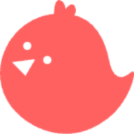
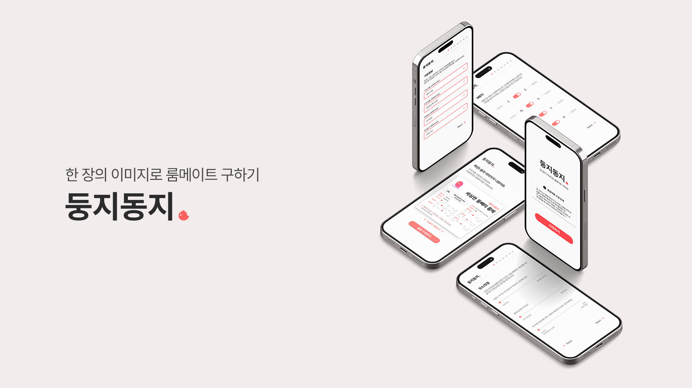
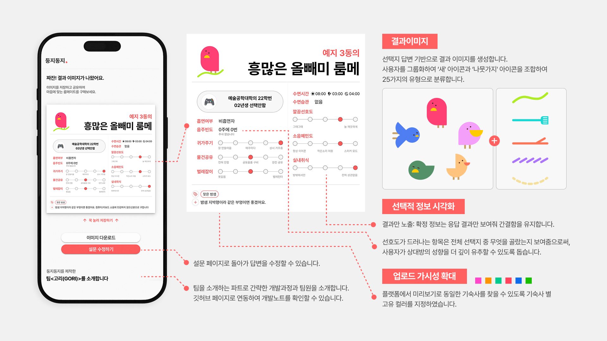
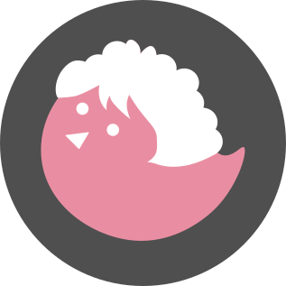
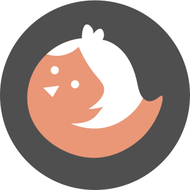
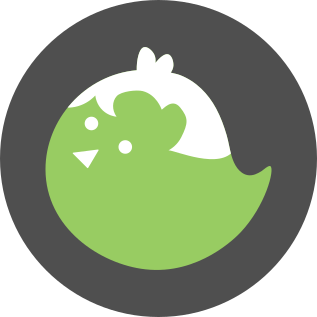
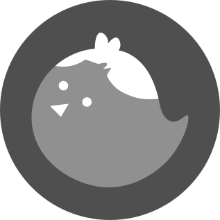

<!-- Improved compatibility of back to top link: See: https://github.com/othneildrew/Best-README-Template/pull/73 -->

<!--
*** Thanks for checking out the Best-README-Template. If you have a suggestion
*** that would make this better, please fork the repo and create a pull request
*** or simply open an issue with the tag "enhancement".
*** Don't forget to give the project a star!
*** Thanks again! Now go create something AMAZING! :D
-->

<!-- PROJECT SHIELDS -->
<!--
*** I'm using markdown "reference style" links for readability.
*** Reference links are enclosed in brackets [ ] instead of parentheses ( ).
*** See the bottom of this document for the declaration of the reference variables
*** for contributors-url, forks-url, etc. This is an optional, concise syntax you may use.
*** https://www.markdownguide.org/basic-syntax/#reference-style-links
-->

<!-- [![Contributors][contributors-shield]][contributors-url]
[![Forks][forks-shield]][forks-url]
[![Stargazers][stars-shield]][stars-url]
[![Issues][issues-shield]][issues-url]
[![project_license][license-shield]][license-url] -->

<!-- PROJECT LOGO -->
 

  

<h1 align="center">둥지동지</h1>

  

    🖼️ 한 장의 이미지로 룸메이트 구하기!
     
    <a href="https://getourri.github.io/DungDong"><strong>둥지동지 바로가기</strong></a>
     
     
  

<!-- 프로젝트 소개 -->
## 프로젝트 소개

둥지동지는 중앙대학교 다빈치 캠퍼스의 학우들이 기숙사 룸메이트를 빠르고 편하게 구할 수 있도록 기획한 프로젝트입니다. 
자신의 기숙사 생활에 대한 설문을 기반으로 룸메이트 구인 글에 사용할 이미지를 자동으로 생성해줍니다.
모바일 웹에 최적화된 UI를 통해 누구나 간편하게 이용할 수 있습니다.

(<a href="#readme-top">back to top</a>)

### 🎯 주요기능

✅  **기숙사 룸메이트 구인 설문 제공**  
  둥지동지에서 제공하는 설문을 통해 사용자가 자신의 기숙사 생활 습관 및 선호사항을 입력할 수 있습니다.

✅ **설문 결과 기반 타이틀 생성**  
  입력된 응답을 바탕으로 사용자의 특성을 한 줄로 요약한 소개 문구를 자동으로 생성합니다.
  
✅ **AI를 활용한 자동 이미지 생성 기능**  
  기존에 작성한 룸메이트 구인 글을 그대로 붙여넣으면, AI가 텍스트를 분석하여 설문 항목을 자동으로 완성하고 결과 이미지를 생성합니다.

✅ **최종 결과 이미지 생성 및 다운로드 지원**  
  설문 결과를 한 장의 이미지(1000 x 1000px)로 시각화하고, 이미지를 바로 다운로드하여 룸메이트 구인 게시글에 사용할 수 있습니다.

(<a href="#readme-top">back to top</a>)

### 😎 함께한 사람들
둥지동지를 제작한 **팀 고리(GORI - Get Our Roommate Instantly)** 를 소개합니다. 팀 고리는 중앙대 **예술공학부**를 기반에 두고 모였습니다. 
 덧붙여, <둥지동지> 이름을 지어준 김태희씨, 제작에 힘이 되어준 칸타르 친구들에게 감사인사를 드립니다.

|  | 이름 | 역할 | 비고 |
|--------|------|-------|------|
|  | 조은비 | `최초 기획` `프론트 개발` `백엔드 개발` | [github](https://github.com/Ebee1205) [블로그](https://wavicle.tistory.com/) |
|  | 백지오 | `UX/UI 디자인` `편집 디자인` | [github](https://github.com/jio311) [포트폴리오](https://sites.google.com/view/jiographic) |
|  | 고예경 | `QA` `UX 개선` `기획안 개선` | [github](https://github.com/ZakZak0112) |
|  | 박정민 | `프론트 개발` `프론트 유지보수` | [github](https://github.com/jeongminnnnni) [블로그](https://jeongm1n1.tistory.com) |
|  | 홍민기 | `데이터 분석` | [github](https://github.com/mingiraffe) [블로그](https://mingiraffe03.tistory.com) |

(<a href="#readme-top">back to top</a>)

### 📚 기술 스택

[![Vue][Vue.js]][Vue-url]
[![Vuetify][Vuetify]][Vuetify-url] 
[![python][python]][python-url]
[![FastAPI][FastAPI]][FastAPI-url]
[![Firebase][Firebase]][Firebase-url]
[![GoogleGemini][GoogleGemini]][GoogleGemini-url]
[![Github Pages][Github Pages]][Github-Pages-url] 
[![Render][Render]][Render-url] 
[![Figma][Figma]][Figma-url] 

(<a href="#readme-top">back to top</a>)

<!-- 로드맵 -->
## 🛠️ 로드맵
### ✅ 완료된 기능
- [x] **관별 색상 차별화 적용**  
  기숙사 관(건물)별로 결과 이미지에 색상 구분을 적용했습니다.  
  (`v1.0.1` 반영 완료)

### 🏗️ 예정된 기능
- [ ] **이어하기 기능 추가**  
  설문 진행 중이거나 완료된 결과를 저장하고 나중에 이어서 작업할 수 있도록 개선할 예정입니다.

- [ ] **룸메이트 구인글 이미지 생성 기능**  
  작성된 룸메이트 구인글을 기반으로 자동 요약 및 이미지 생성을 제공할 예정입니다.  
  (`v2.0.0` 이후 적용 예정)

추후 업데이트를 통해 더욱 직관적이고 편리한 기능을 제공할 예정이니 많은 관심 부탁드립니다!

(<a href="#readme-top">back to top</a>)

### 🚀 업데이트 내역
자세한 업데이트 내용은 릴리즈 노트를 참고해 주세요!

| FE 버전     | BE 버전     | 출시 날짜      | 주요 업데이트                              |
| --------- | --------- | ---------- | ------------------------------------ |
| **2.0.0** | **1.0.0** | 2025.10.10 | FE·BE 통합 배포 시작, AI 기능 추가|
| **1.0.2** | –         | 2025.02.15 | 이미지 출처 표시 추가, 이슈 템플릿 도입              |
| **1.0.1** | –         | 2025.02.10 | 기숙사별 색상 구분, 이미지 저장 버튼 추가             |
| **0.4.1** | –         | 2025.02.08 | 버그 픽스 및 기능 추가                        |
| **0.4.0** | –         | 2025.02.07 | 베타버전 배포                              |

(<a href="#readme-top">back to top</a>)

### 📝 작업기
- 📌 [둥지동지의 시작 - @조은비 [25년 2월 3일]](making/Making_1.md)
- 📌 [둥지동지 다시 기획하기 - @조은비, 백지오 [25년 2월 8일]](making/Making_2.md)
- 📌 [둥지동지 디자인 작업기 - @백지오 [25년 2월 11일]](making/Making_3.md)
- 📌 둥지동지 개발하기 - @조은비 [공개 예정]
<!-- - 둥동 만들기 - 
- 둥동 만들기 -->

(<a href="#readme-top">back to top</a>)

<!-- 레퍼런스 -->
## 레퍼런스
이 프로젝트는 아래의 프로젝트에서 영감을 받아 제작되었습니다.
* [썸네일 메이커](https://blog.wonkooklee.com/playground/thumbnail-maker/)
* [Receiptify](https://receiptify.herokuapp.com)

(<a href="#readme-top">back to top</a>)

<!-- MARKDOWN LINKS & IMAGES -->
<!-- https://www.markdownguide.org/basic-syntax/#reference-style-links -->
[contributors-shield]: https://img.shields.io/github/contributors/github_username/repo_name.svg?style=for-the-badge
[contributors-url]: https://github.com/github_username/repo_name/graphs/contributors
[forks-shield]: https://img.shields.io/github/forks/github_username/repo_name.svg?style=for-the-badge
[forks-url]: https://github.com/github_username/repo_name/network/members
[stars-shield]: https://img.shields.io/github/stars/github_username/repo_name.svg?style=for-the-badge
[stars-url]: https://github.com/github_username/repo_name/stargazers
[issues-shield]: https://img.shields.io/github/issues/github_username/repo_name.svg?style=for-the-badge
[issues-url]: https://github.com/github_username/repo_name/issues
[license-shield]: https://img.shields.io/github/license/github_username/repo_name.svg?style=for-the-badge
[license-url]: https://github.com/github_username/repo_name/blob/master/LICENSE.txt

[product-screenshot]: images/screenshot.png

[Vue.js]: https://img.shields.io/badge/Vue.js-35495E?style=for-the-badge&logo=vuedotjs&logoColor=4FC08D
[Vue-url]: https://vuejs.org/

[Vuetify]: https://img.shields.io/badge/Vuetify-1867C0?style=for-the-badge&logo=vuetify&logoColor=AEDDFF
[Vuetify-url]: https://vuetifyjs.com/

[Figma]: https://img.shields.io/badge/figma-%23F24E1E.svg?style=for-the-badge&logo=figma&logoColor=white
[Figma-url]: https://www.figma.com/

[Firebase]: https://img.shields.io/badge/firebase-a08021?style=for-the-badge&logo=firebase&logoColor=ffcd34
[Firebase-url]: https://firebase.google.com/

[fastAPI]: https://img.shields.io/badge/FastAPI-005571?style=for-the-badge&logo=fastapi
[fastAPI-url]: https://fastapi.tiangolo.com/ko/

[Python]: https://img.shields.io/badge/python-3670A0?style=for-the-badge&logo=python&logoColor=ffdd54
[Python-url]: https://www.python.org/

[GoogleGemini]: https://img.shields.io/badge/google%20gemini-8E75B2?style=for-the-badge&logo=google%20gemini&logoColor=white
[GoogleGemini-url]: https://gemini.google.com/

[Github Pages]:https://img.shields.io/badge/github%20pages-121013?style=for-the-badge&logo=github&logoColor=white
[Github-Pages-url]: https://pages.github.com/

[Render]: https://img.shields.io/badge/Render-%46E3B7.svg?style=for-the-badge&logo=render&logoColor=white
[Render-url]: https://render.com/